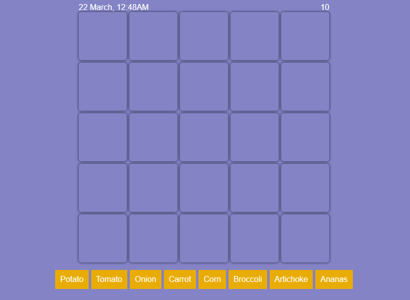

# GPT Garden Game

## Description

GPT Garden is a fun and engaging HTML5 game where players plant vegetables in a 5x5 garden, watch them grow, and harvest them for revenue. The game showcases the unique concept of accelerated time, where every real-world second represents 24 minutes in the game. The game also follows the pattern of sunrise and sunset throughout the year, which affects the growth of the vegetables.

## How to Play

1. **Select a vegetable:** Click on a vegetable from the list on the right.
2. **Plant the vegetable:** Click on an empty tile in the garden to plant the selected vegetable. The cost of the vegetable is deducted from your current funds.
3. **Watch your vegetables grow:** Vegetables grow during daylight hours. The remaining growth time for each vegetable decreases by 24 in-game minutes every real-world second, but only between sunrise and sunset.
4. **Harvest your vegetables:** When a vegetable's growth time reaches zero, the tile turns green, indicating that the vegetable is ready to be harvested. Click the green tile to harvest the vegetable and add its revenue to your funds.
5. **Win the game:** The game ends when your total revenue reaches 1000 units.

## Technologies Used

The game is built entirely in HTML5, CSS3, and JavaScript. The game uses vanilla JavaScript, without any external libraries or frameworks, making it a lightweight and fast-loading game.

## Setup and Installation

To set up the game locally on your machine:

1. Clone the repository using the command `git clone https://github.com/JLoroy/gpt-garden.git`.
2. Navigate into the cloned repository using the command `cd gpt-garden`.
3. Open the `index.html` file in your browser.

## Contributing

If you have suggestions for how GPT Garden could be improved, or want to report a bug, open an issue! Contributions of all kinds are welcomed!

## License

GPT Garden is open source, and is licensed under the [MIT License](./LICENSE).

## Acknowledgments

The game was created by GPT-4, a large language model trained by OpenAI.

---
